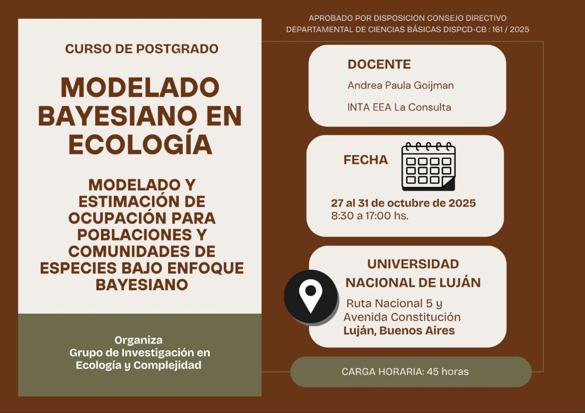
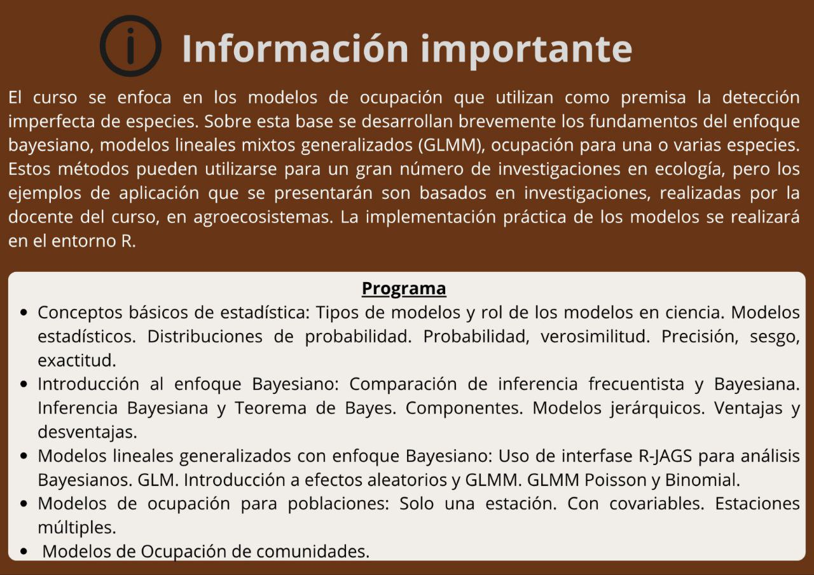
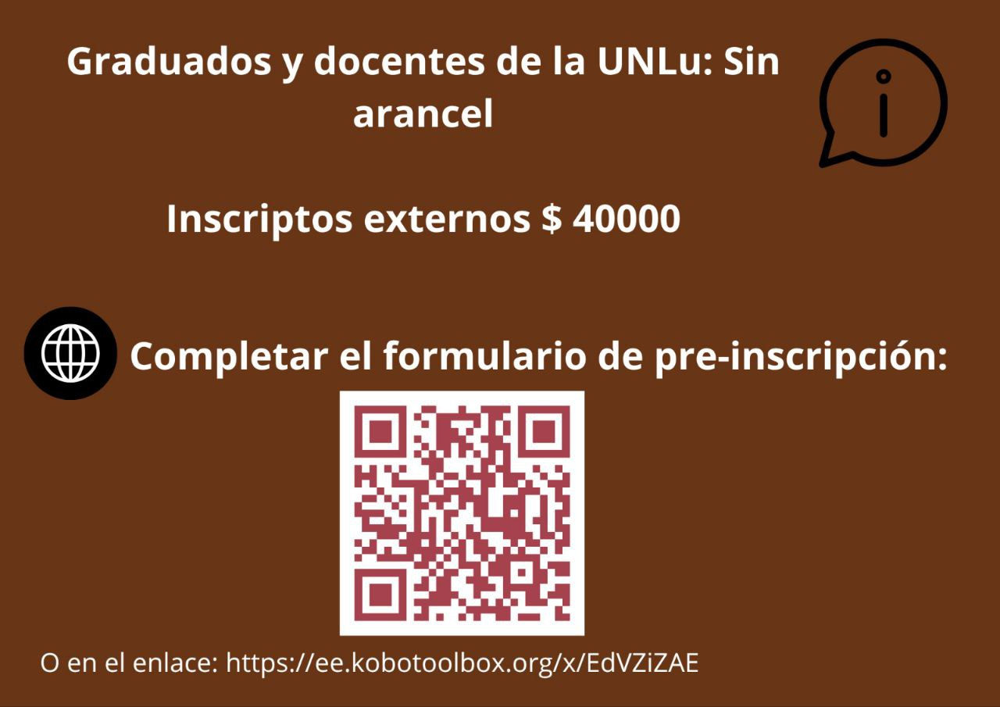
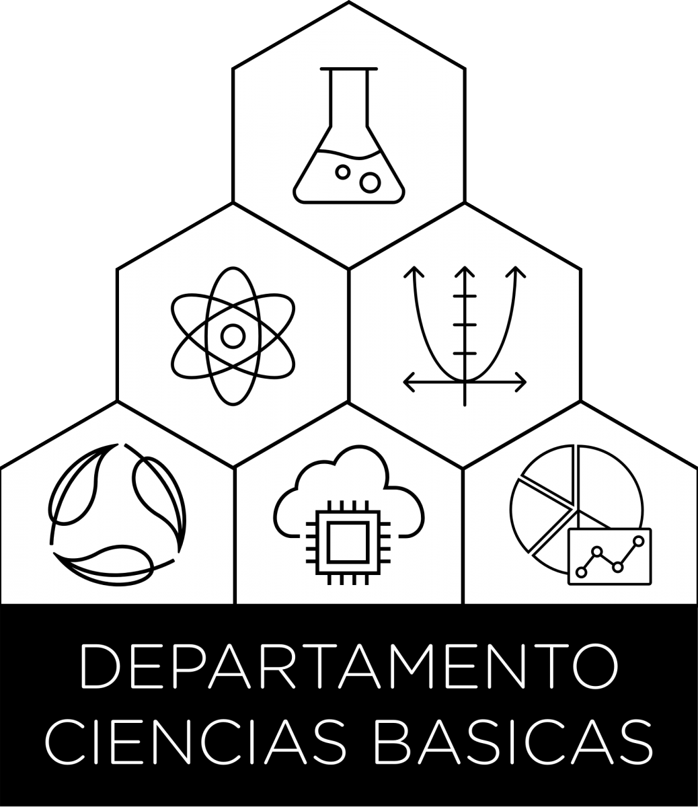

# Curso de Posgrado: 
## Modelado y estimación de ocupación para poblaciones y comunidades de especies bajo enfoque Bayesiano

{width=50%}

{width=50%}

{width=50%}

_________________________________________________________________________

Les compartimos la información de este curso de posgrado que se estará dictando en la sede central de la Universidad Nacional de Luján, entre los días 27 al 31 de octubre de este año. 

Para quienes estén interesados/as,  los invitamos a llenar el formulario de pre-inscripción,  mediante el código QR o en el [enlace](https://ee.kobotoolbox.org/x/EdVZiZAE).

¡Los esperamos en la UNLu!

**Grupo de Investigación en Ecología y Complejidad**

**Departamento de Ciencias Básicas, Universidad Nacional de Luján**

_________________________________________________________________________

 

## Programa del curso

**UNIVERSIDAD NACIONAL DE LUJAN**

**DEPARTAMENTO DE CIENCIAS BÁSICAS**

**CURSO DE POSGRADO:**

## Modelado y estimación de ocupación para poblaciones y comunidades de especies bajo enfoque Bayesiano

|Docentes |  |   |
| :---- | :---- | :---- |
| Responsable Académica | Rojo Verónica | Doctora en Ciencias Agrarias y Forestales |    
| Docente       | Goijman  Andrea Paula     | PhD in Forest Resources, Wildlife Ecology and Management |
| Colaboradores | Duhour Andrés Esteban   | Doctor en Ciencia y Tecnología |
|               | Díaz Porres Mónica     | Doctora en Ciencias Biológicas  |
|               | Bessega Florencia     | Licenciada en Ciencias Biológicas |
|               | Carreras Ángeles Araceli  | Licenciada en Biodiversidad   |

## Carga horaria:

45 horas   

## Objetivos y contenidos:      

  **Objetivos:**                                                          
                                                                         
  - Introducir al estudiante en los modelos de ocupación con detección   
  imperfecta de especies.                                                
                                                                         
  - Que los estudiantes comprendan los fundamentos del enfoque           
  bayesiano.                                                             
                                                                         
  - Realizar aplicaciones estos modelos, mediante programación en R,     
  al estudio de casos en agroecosistemas.                                
                                                                         
  **Programa sintético:**                                                
                                                                         
  Este curso se enfoca en los modelos de ocupación que utilizan como     
  premisa la detección imperfecta de especies. Sobre esta base se        
  desarrollan brevemente los fundamentos del enfoque bayesiano, modelos  
  lineales mixtos generalizados (GLMM), ocupación para una o varias      
  especies. Estos métodos pueden utilizarse para un gran número de       
  investigaciones en ecología, pero los ejemplos de aplicación que se    
  presentarán son basados en investigaciones, realizadas por la docente  
  del curso, en agroecosistemas. La implementación práctica de los       
  modelos se realizará en el entorno R.                                  
                                                                         
  **Programa analítico:**                                                
                                                                         
  - Conceptos básicos de estadística: Tipos de modelos y rol de los      
  modelos en ciencia - Modelos estadísticos - Distribuciones de          
  probabilidad - Probabilidad, verosimilitud - Precisión, sesgo,         
  exactitud.                                                             
                                                                         
  - Introducción al enfoque Bayesiano: Comparación de inferencia         
  frecuentista y Bayesiana - Inferencia Bayesiana y Teorema de Bayes     
  -Componentes - Modelos jerárquicos - Ventajas y desventajas            
                                                                         
  - Modelos lineales generalizados con enfoque Bayesiano: Uso de         
  interfase R-JAGS para análisis Bayesianos -- GLM -- Introducción a     
  efectos aleatorios y GLMM -- GLMM Poisson y Binomial                   
                                                                         
  - Modelos de ocupación para poblaciones: Solo una estación - Con       
  covariables - Estaciones múltiples                                     
                                                                         
  - Modelos de Ocupación de comunidades.                                 
 

## Evaluación del curso:                                              

### Requisitos para acceder al certificado de asistencia:
 
                                                                         
  Deberán asistir al 75 % de las clases como mínimo y realizar y         
  entregar los ejercicios prácticos de todas las clases.                 
 

### Requisitos para acceder al certificado de aprobación:  
 
                                                                         
  La evaluación consistirá en la presentación de un trabajo final        
  grupal que deberán entregar para su corrección 15 días después de      
  finalizado el curso presencial. En la nota final se tendrá en cuenta   
  la participación individual del estudiante a lo largo del curso y el   
  trabajo final.                                                         
 

## Bibliografía:      

 
                                                                         
  1.  Goijman, A. P., Conroy, M. J., Bernardos, J. N., and               
      Zaccagnini, M. E. 2015. Multi-season regional analysis of          
      multi-species occupancy: implications for bird conservation in     
      agricultural lands in east-central Argentina. *PLoS                
      One*, *10*(6), e0130874.                                           
                                                                         
  2.  Kéry, M. 2010. Introduction to WinBUGS for Ecologists: A Bayesian  
      Approach to Regression, ANOVA and Related Analyses. Access Online  
      via Elsevier.                                                      
                                                                         
  3.  Kery, M. and Royle, J. A. 2021. Applied Hierarchical Modeling in   
      Ecology: Analysis of Distribution, Abundance and Species Richness  
      in R and BUGS: Volume 2: Dynamic and Advanced Models 1st Edición   
      Academic Press                                                     
                                                                         
  4.  Kéry, M., and M. Schaub. 2012. Bayesian population analysis using  
      WinBUGS: a hierarchical perspective. Access Online via Elsevier.   
                                                                         
  5.  MacKenzie, D. I., J. D. Nichols, A. R. Royle, K. H.                
      Pollock, L. L. Bailey, and J. E. Hines. 2006. Occupancy            
      estimation and modeling: inferring patterns and dynamics of        
      species occurrence. Elsevier/Academic Press, Burlington, MA.       
                                                                         
  6.  McCarthy, M. 2007. Bayesian methods for ecology. Cambridge         
      University Press, Cambridge, U.K.                                  
                                                                         
  7.  Royle, J. A., and R. M. Dorazio. 2008. Hierarchical modeling and   
      inference in ecology: the analysis of data from populations,       
      metapopulations and communities. Academic Press.                   
                                                                         
  8.  Royle, J. A., and M. Kery. 2016. Applied Hierarchical Modeling in  
      Ecology: Analysis of distribution, abundance and species richness  
      in R and BUGS: Volume 1: Prelude and Static Models Books.          
      Academic Press.                                                    
 

## Período de desarrollo: 

 
                                                                         
  Lunes 27 de octubre de 2025 al viernes 31 de octubre de 2025.          
                                                                         
  Las clases se desarrollarán de 8:30 a 17:00 hs. con un intervalo para  
  almuerzo.                                                              
                                                                         
  Cada día se propondrán ejercicios para el hogar completando la carga   
  horaria propuesta.                                                     
 

## Modalidad: Presencial 

 
                                                                         
  **Sede de dictado:** Luján                                             
 

## Requisitos de inscripción:
 
                                                                         
  **Título requerido:**                                                  
                                                                         
  Título de grado en Ciencias Biológicas, Ecología, Ciencias             
  Ambientales, Agronomía, Física, Matemática, Estadística, Ingeniería o  
  disciplinas afines.                                                    
                                                                         
  **OTROS REQUISITOS**:                                                  
                                                                         
  -   Formación básica en estadística.                                   
                                                                         
  -   Conocimientos básicos de R                                         
                                                                         
  -   Presentación de carta de intención y cv abreviado para que el      
      equipo docente evalúe los conocimientos previos para la            
      aceptación en el curso (esto se fundamenta en que les estudiantes  
      puedan realmente aprovechar el curso).                             
 

## Límite de inscriptos:
 
                                                                         
    --------------------------------------                               
    **Máximo:** **20** **Mímimo:** **5**                                 
    --------------------------------------                               
                                                                         

  **Orden de prioridad en la selección de inscriptos:**                  
                                                                         
  Se establecerá un orden de sobre la base del cumplimento de los        
  requisitos y la afinidad de titulación y tema de investigación con     
  los contenidos del curso. Cumplidos los requisitos, tendrán prioridad  
  las y los docentes de la Universidad Nacional de Luján.               
 

## Arancel de inscripción: 
 
                                                                           
   Graduados y docentes de la UNLu SIN ARANCEL, otros inscriptos $ 40000 (pesos cuarenta mil)                                              
 

